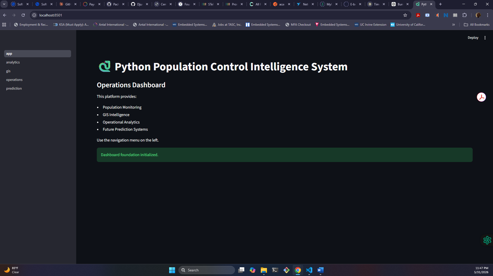
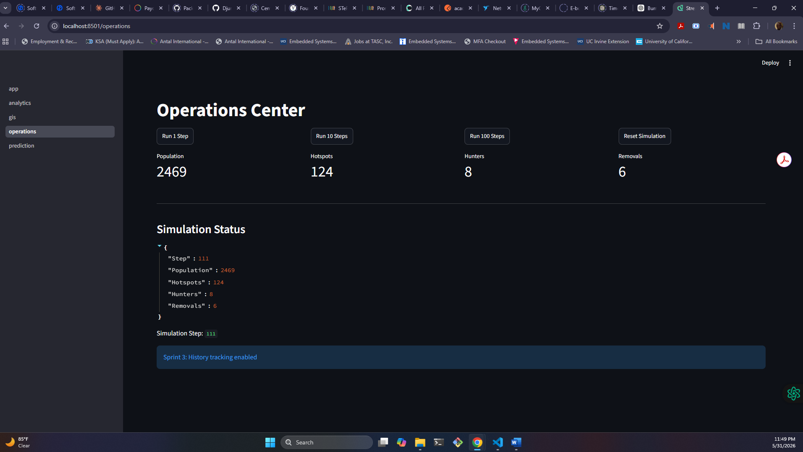
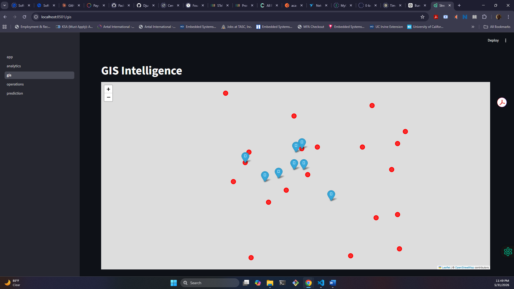
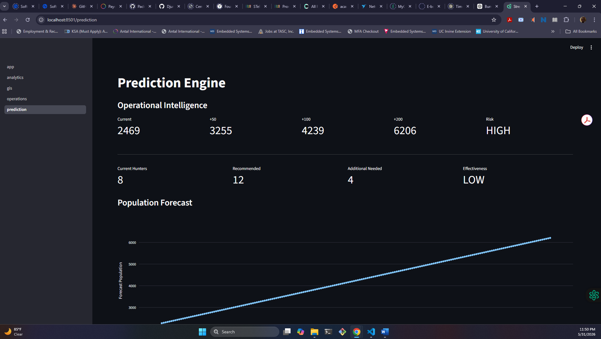

# Python Population Control Intelligence System (PPCIS)

## Ecological Decision Support System (EDSS)

PPCIS (Python Population Control Intelligence System) is an Ecological Decision Support System (EDSS) designed to model, monitor, forecast, and optimize invasive species control operations.

The platform combines:

* Agent-Based Ecological Simulation
* Operational Control Systems
* GIS Intelligence
* Analytics Dashboards
* Population Forecasting
* Operational Recommendations

into a unified decision-support environment.

Originally developed as a Burmese Python population simulation, PPCIS has evolved into a multi-module operational intelligence platform capable of supporting ecological research, invasive species management, and resource allocation analysis.

---

# Project Vision

PPCIS aims to answer three critical operational questions:

### What is happening?

Current population, hotspots, hunter deployment, and removals.

### What will happen?

Population forecasting, risk assessment, and trend analysis.

### What should we do?

Operational recommendations, hunter allocation guidance, and suppression effectiveness analysis.

---

# System Architecture

```text
Population Simulation
          │
          ▼
Habitat Intelligence
          │
          ▼
Detection & Removal
          │
          ▼
Adaptive Optimization
          │
          ▼
GIS Intelligence
          │
          ▼
Analytics Engine
          │
          ▼
Prediction Engine
          │
          ▼
Operational Intelligence
```

---

# Core Capabilities

| Capability                  | Status |
| --------------------------- | ------ |
| Agent-Based Simulation      | ✅      |
| Population Modeling         | ✅      |
| Reproduction Dynamics       | ✅      |
| Mortality Modeling          | ✅      |
| Hunter Teams                | ✅      |
| Detection & Removal         | ✅      |
| Hotspot Detection           | ✅      |
| Adaptive Optimization       | ✅      |
| GIS Mapping                 | ✅      |
| Operations Dashboard        | ✅      |
| Analytics Dashboard         | ✅      |
| Population Forecasting      | ✅      |
| Risk Assessment             | ✅      |
| Operational Recommendations | ✅      |

---

# Dashboard Modules

## Operations Center

Provides real-time operational control of the simulation.

Features:

* Population Monitoring
* Hotspot Monitoring
* Hunter Monitoring
* Removal Monitoring
* Run 1 Step
* Run 10 Steps
* Run 100 Steps
* Reset Simulation

---

## Analytics Engine

Provides historical performance analysis.

Features:

* Population Trends
* Removal Trends
* Hotspot Trends
* Interactive Plotly Visualizations
* Historical Data Tables

---

## GIS Intelligence

Provides geospatial visualization.

Features:

* Interactive Folium Mapping
* Hotspot Visualization
* Hunter Deployment Visualization
* Geographic Coordinate Mapping

Current Status:

* Functional
* Known tile rendering issue under investigation

---

## Prediction Engine

Provides population forecasting.

Features:

* Population Forecast (+50 Steps)
* Population Forecast (+100 Steps)
* Population Forecast (+200 Steps)
* Forecast Visualization
* Risk Assessment

---

## Operational Intelligence

Provides decision-support recommendations.

Features:

* Recommended Hunter Count
* Additional Hunter Requirements
* Suppression Effectiveness Assessment
* Risk-Based Operational Guidance

---

# Ecological Simulation Components

## Population Agents

Models:

* Movement
* Reproduction
* Mortality
* Habitat Selection

---

## Habitat Intelligence

Environmental factors include:

* Vegetation
* Environmental Suitability
* Local Population Density

Agents preferentially migrate toward favorable habitat.

---

## Hunter Teams

Hunter teams perform:

* Detection
* Removal
* Target Pursuit
* Hotspot Suppression

---

## Adaptive Optimization

The optimization engine continuously:

* Identifies hotspots
* Prioritizes targets
* Reassigns hunter teams
* Improves suppression efficiency

---

# Project Structure

```text
python_control_sim/

├── dashboard/
│   ├── app.py
│   ├── simulation_manager.py
│   └── pages/
│       ├── operations.py
│       ├── analytics.py
│       ├── gis.py
│       └── prediction.py
│
├── docs/
│
├── maps/
│   └── everglades_map.html
│
├── config.py
├── environment.py
├── gis.py
├── hunter.py
├── main.py
├── optimizer.py
├── python_agent.py
├── simulation.py
├── visualization.py
├── requirements.txt
└── README.md
```

---

# Technology Stack

## Core

* Python 3.x

## Simulation

* NumPy
* Random

## Dashboard

* Streamlit

## Analytics

* Pandas
* Plotly

## GIS

* Folium

## Forecasting

* NumPy

---

# Installation

Clone the repository:

```bash
git clone https://github.com/YOUR_USERNAME/PPCIS.git
cd PPCIS
```

Install dependencies:

```bash
pip install -r requirements.txt
```

Launch Dashboard:

```bash
streamlit run dashboard/app.py
```

Run Simulation:

```bash
python main.py
```

---

# Typical Workflow

```text
Launch Dashboard
        │
        ▼
Operations Center
        │
        ▼
Generate Simulation Data
        │
        ▼
Analytics Engine
        │
        ▼
GIS Intelligence
        │
        ▼
Prediction Engine
        │
        ▼
Operational Recommendations
```

---

# Screenshots

## Dashboard Home



The main entry point to PPCIS providing navigation to Operations, Analytics, GIS Intelligence, and Prediction modules.

---

## Operations Center



Real-time simulation control and monitoring including population tracking, hotspot monitoring, hunter deployment, removals, and simulation execution controls.

---

## Analytics Engine


Historical trend analysis for population growth, suppression activity, hotspot development, and operational performance metrics.

---

## GIS Intelligence



Interactive geospatial visualization displaying hotspots, hunter deployment locations, and operational intelligence layers.

---

## Prediction Engine



Population forecasting, risk assessment, suppression effectiveness analysis, and operational recommendations.

---

# Known Issues

## GIS Tile Rendering

The GIS subsystem successfully renders:

* Hunter Locations
* Hotspot Locations
* Interactive Controls

A known issue currently affects OpenStreetMap tile rendering under certain local deployment environments.

This issue does not affect simulation logic, analytics, forecasting, or operational intelligence.

---

# Future Enhancements

## Version 2.0

### Advanced GIS

* Wetland Layers
* Waterways
* Road Networks
* Sector Management

### Advanced Forecasting

* Scikit-Learn Models
* Random Forest Forecasting
* Time-Series Analysis

### Decision Intelligence

* Resource Planning
* Budget Optimization
* Control Strategy Evaluation

### Reinforcement Learning

* Adaptive Hunter Deployment
* Autonomous Optimization Policies

### Drone Surveillance

* Drone Agents
* Search Coverage Analysis
* Aerial Detection Modeling

---

# Research Applications

Potential applications include:

* Invasive Species Management
* Ecological Operations Research
* Conservation Planning
* Resource Allocation Optimization
* Environmental Intelligence Systems
* Decision Support Systems

---

# Disclaimer

PPCIS is a research and educational platform.

Simulation outputs should not be interpreted as real-world ecological recommendations without validation using field data, ecological expertise, and operational constraints.

---

# Author

**Kabir Said**

Areas of Interest:

* Ecological Modeling
* GIS Intelligence
* Operations Research
* Data Analytics
* Forecasting Systems
* AI-Assisted Decision Support
